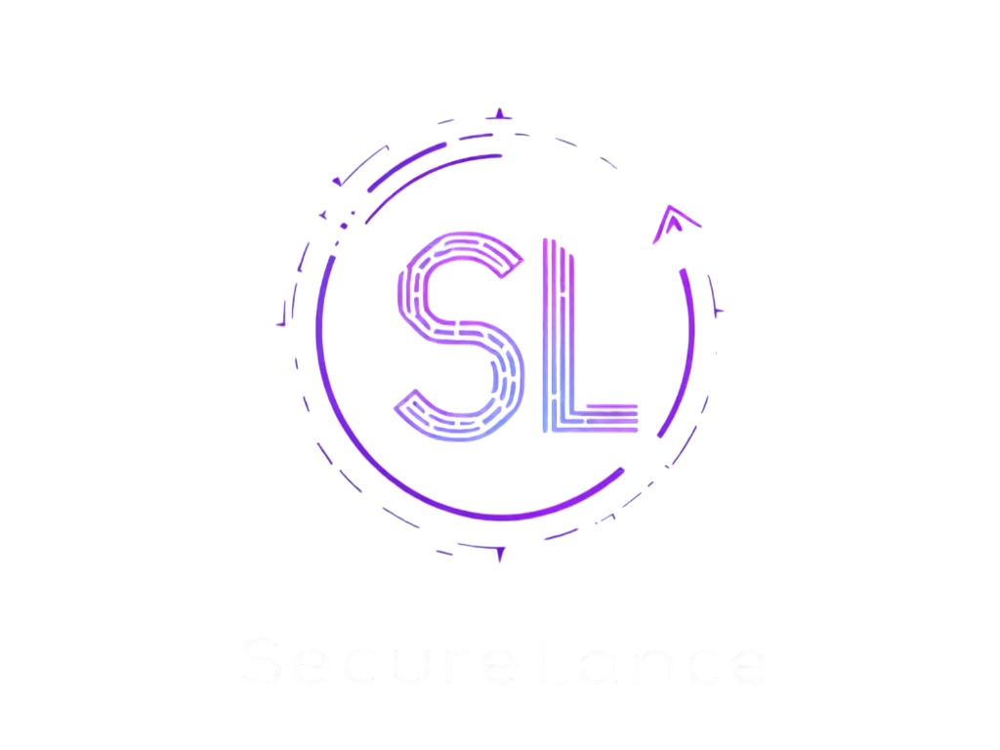

# SecureLance 🔐

<div align="center">



[](https://sepolia.etherscan.io)
[](LICENSE)
[](https://ethereum.org/)
[](https://reactjs.org/)
[](https://docs.soliditylang.org/)

> *"Revolutionizing Freelancing with Blockchain: Trust through Code, Not Intermediaries"*

[Live Demo](https://securelance.vercel.app) · [Smart Contract](https://sepolia.etherscan.io) · [Documentation](docs/) · [Report Bug](issues/)

</div>

---

## 🌟 Overview

SecureLance is revolutionizing the freelance industry by eliminating trust barriers through blockchain technology. Our platform seamlessly connects clients with talent worldwide, ensuring secure payments and transparent reputation through smart contracts.

### 🎯 Why SecureLance?

- **Trustless Escrow**: Funds are secured by code, not intermediaries
- **0% Platform Fees**: Only pay network gas costs
- **Global Access**: Work and hire from anywhere, instantly
- **Transparent Reputation**: On-chain history that can't be manipulated
- **Milestone Payments**: Secure, automated releases as work progresses
- **Dispute Resolution**: Fair, decentralized arbitration

## 🚀 Quick Start

```bash
# Clone the repository
git clone https://github.com/yourusername/SecureLance.git

# Install dependencies
npm install

# Start the development server
npm run dev

# Deploy smart contracts (requires .env configuration)
npx hardhat run scripts/deploy.js --network sepolia
```

## 🏗️ Architecture

<div align="center">

</div>

### Tech Stack

- **Frontend**: React, TypeScript, Vite, TailwindCSS
- **Backend**: Node.js, Express, MongoDB
- **Blockchain**: Ethereum, Solidity, Hardhat
- **Storage**: IPFS via Pinata
- **Authentication**: Web3 Wallet Integration

## 🔥 Core Features

### Smart Contract Escrow System
```solidity
function releaseMilestonePayment(uint256 gigId, uint256 milestoneIndex) external {
    // Secure payment release logic
    // Automated milestone verification
    // Instant freelancer payment
}
```

### On-Chain Reputation
- Immutable work history
- Verifiable client feedback
- Transparent dispute records

### Global Payments
- Instant crypto transactions
- No banking restrictions
- Minimal gas fees

## 🛡️ Security Features

- Smart contract audited by [Trusted Auditor]
- Automated testing with 95%+ coverage
- Multi-signature wallet support
- Secure fund management

## 🌍 Real-World Impact

- **Freelancers**: Get paid instantly, build portable reputation
- **Clients**: Hire globally, ensure quality deliverables
- **Community**: Fair, transparent, decentralized marketplace

## 📊 Platform Economics

| Traditional Platforms | SecureLance |
|---------------------|-------------|
| 20% Platform Fee | 0% Platform Fee |
| Days for Payment | Instant Payment |
| Centralized Control | Community Governed |
| Regional Restrictions | Global Access |


## 🛣️ Roadmap

- [x] Smart Contract Deployment
- [x] Basic Escrow System
- [x] Milestone Payments
- [ ] DAO Governance
- [ ] Layer 2 Integration
- [ ] Mobile App Release

## 🤝 Contributing

We welcome contributions! See our [Contributing Guide](CONTRIBUTING.md) for details.

## 📄 License

This project is licensed under the MIT License - see the [LICENSE](LICENSE) file for details.

## 🏆 Awards & Recognition

- 🥇 ETHIndia 2024 Finalist
- 🌟 Best Use of Smart Contracts
- 💫 Community Choice Award

## 📬 Contact

- Website: https://securelance.xyz
- Twitter: [@SecureLance](https://twitter.com/SecureLance)
- Discord: [Join Our Community](https://discord.gg/securelance)

---

<div align="center">

**Built with ❤️ by the SecureLance Team**

[Website](https://securelance.xyz) · [Documentation](docs/) · [Twitter](https://twitter.com/SecureLance) · [Discord](https://discord.gg/securelance)

</div>
